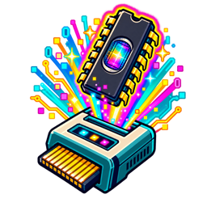
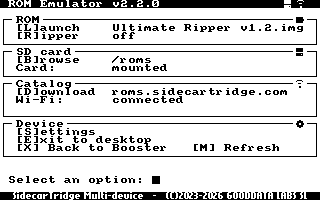
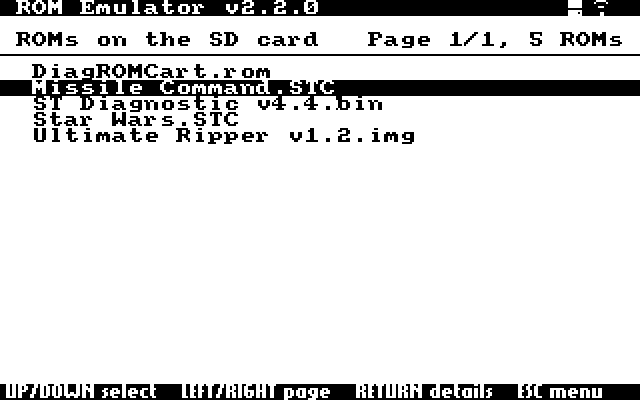
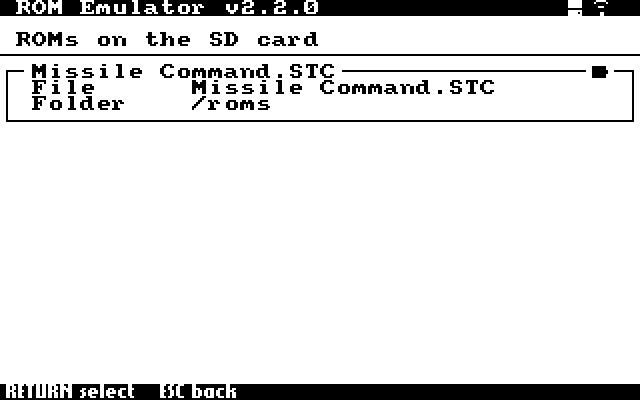
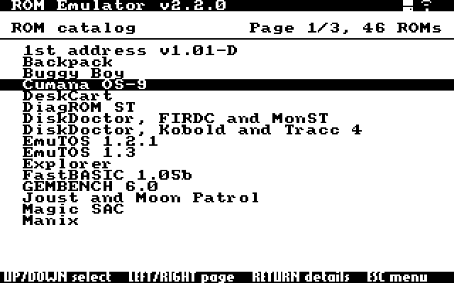
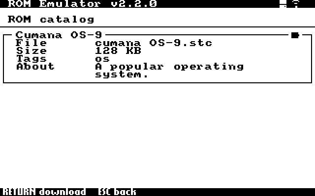
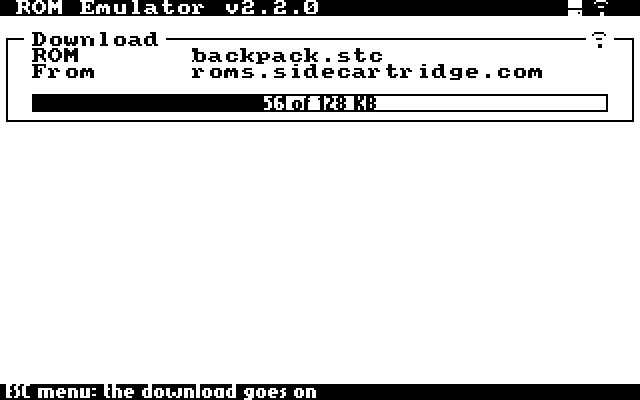
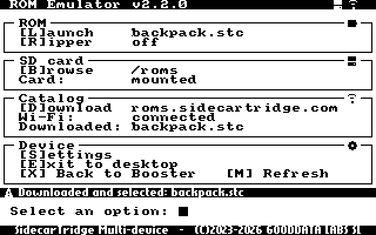
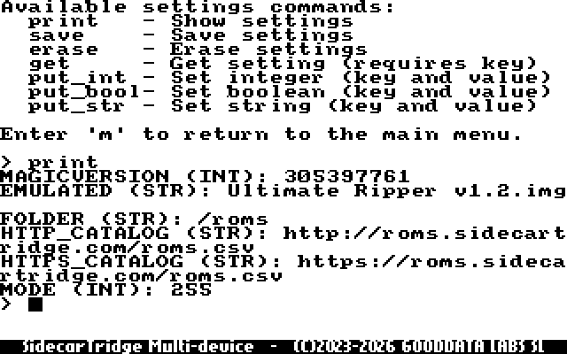
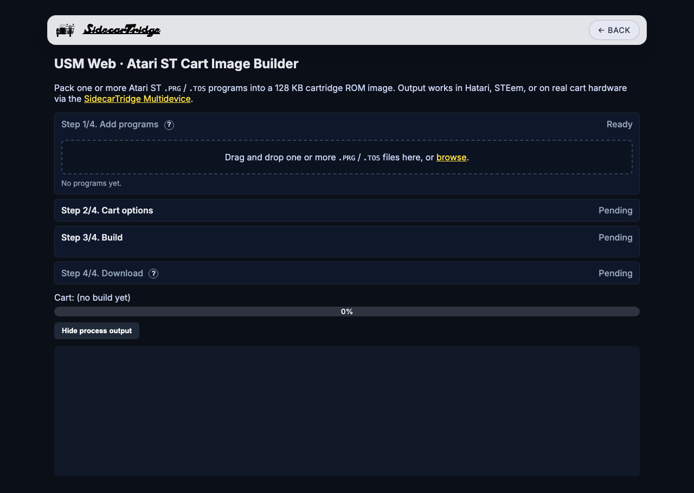

# SidecarTridge Multi-device ROM Emulator app

This is a microfirmware app for the SidecarTridge Multi-device that emulates the cartridge ROM of an Atari ST, STE, Mega ST, Mega STE or Falcon computer: pick a ROM image from the microSD card or download one from the internet catalog, and the computer runs it as if a physical cartridge were plugged in.

> 🛒 **Get the hardware:** [SidecarTridge Multi-device](https://sidecartridge.com/products/sidecartridge-multidevice-atari-st/)

## 🚀 Installation

To install the ROM Emulator app on your SidecarTridge Multi-device:

1. Launch the **Booster App** on your SidecarTridge Multi-device.
2. Open the Booster web interface.
3. In the **Apps** tab, select **"ROM Emulator"** from the list of available apps.
4. Click **"Download"** to install the app to your SidecarTridge's microSD card.
5. Once installed, select the app and click **"Launch"** to activate it.

After launching, the app runs every time your Atari computer is powered on. An update installed from Booster keeps your settings, your selected ROM and its mode.

## 🕹️ Usage

When no ROM has been launched, the computer shows the **setup screen**. When one has, the computer runs it at every power-on and reset, until you press **`SELECT`** on the Multi-device (see [The SELECT button](#-the-select-button)).

The bar at the top shows the microSD card's and the Wi-Fi's icons. Each section shows its state: the selected ROM and the Delay/Ripper mode, the card, the network and the last download. A message, such as a ROM just selected, shows for a few seconds on a dark band above the prompt.

### ⚙️ Setup Screen Keys

Each option is a single key, with no RETURN:

| Key | Description |
|-----|-------------|
| **B** | Browse the ROM files on the microSD card. |
| **D** | Download a ROM file from the internet catalog. |
| **L** | Launch the selected ROM. |
| **R** | Turn the Delay/Ripper mode on or off. |
| **S** | Settings: change the app's settings with typed commands. |
| **E** | Exit to the desktop without loading a ROM. |
| **X** | Return to the Booster menu. |
| **M** | Draw the menu again. |

The SHIFT keys no longer boot the desktop from the setup screen: use **E**.

### 💾 Browsing the ROMs on the microSD Card

**B** lists the ROM files in the ROM folder (`/roms` by default; the `FOLDER` setting). Files ending in `.img`, `.rom`, `.stc` or `.bin` are listed; a ROM can be up to 128 KB (`.stc` images carry 4 more bytes at the start).

Move with the cursor keys: UP and DOWN through the list, LEFT and RIGHT a page at a time. RETURN shows the ROM's details:

RETURN again selects it, and the setup screen comes back with it as the ROM to launch. ESC goes back.

### ⬇️ Downloading ROMs from the Catalog

**D** lists the ROMs in the internet catalog. The app keeps a copy of the catalog on the microSD card and refreshes it in the background whenever the network comes up, so the list is there even when the network is not (the screen says so).

RETURN on a ROM shows its details:

RETURN again downloads it to the ROM folder, with its progress on the screen. ESC goes back to the setup screen while the download goes on, its progress shown in the Catalog section.

When it is complete, the ROM is selected, ready to launch:

The catalog and the ROMs come over HTTPS, from `https://roms.sidecartridge.com/roms.csv` by default. To use a catalog of your own, set its URL in the `HTTPS_CATALOG` setting; it can be `https://` or `http://`, and its ROMs are fetched from the same server. The connection is encrypted, but the server's certificate is not verified. Wi-Fi is set up in Booster; if the network drops, the app joins it again by itself.

### 🛠️ Settings

**S** opens the settings, which take typed commands, each ended with RETURN: `print` lists them, `get KEY` shows one, `put_str KEY VALUE` changes a text setting (`put_int` and `put_bool` the others), and `save` keeps the changes. `m` and RETURN, or ESC, go back to the setup screen.

| Setting | Meaning |
|---------|---------|
| `FOLDER` | The ROM folder on the microSD card. |
| `HTTPS_CATALOG` | The catalog's URL. |
| `EMULATED` | The selected ROM. |
| `MODE` | 255 for the setup screen; 0 runs the ROM, 1 waits for `SELECT` first (Delay/Ripper). |

### 🚀 Launching a ROM

**L** writes the selected ROM to the Multi-device's flash memory, with its progress on the screen, reads it back, and resets the computer into it. The computer then behaves as if the ROM were on a physical cartridge, at every reset and power-on. A ROM that cannot be launched (missing, empty, larger than 128 KB) is refused with the reason, and the previous one stays.

### 🔘 The SELECT Button

- **A short press while a ROM runs** brings the setup screen back: press it, then reset the computer.
- **In Delay/Ripper mode,** the first press starts the ROM (see below).
- **Holding it for 10 seconds** is a factory reset: the Multi-device's settings are erased and it starts Booster.

### ❌ Delay/Ripper Mode

The **Delay/Ripper mode** loads the ROM only when you press the **`SELECT`** button on your Multi-device: the computer boots without the cartridge until then. To turn it on or off, press **R** in the setup screen before launching.

The Ripper mode was useful combined with tools like [Ultimate Ripper](https://www.atarimania.com/utility-atari-st-ultimate-ripper_s20034.html). To use it, follow these steps:
1. Download the Ultimate Ripper ROM file from the catalog (**D**).
2. Turn the Ripper mode on in the setup screen (**R**).
3. Launch the Ultimate Ripper ROM file (**L**).
4. Now reset or power cycle your Atari computer and load your own application or game.
5. When you want to rip the ROM, press the **`SELECT`** button on your Multi-device. The game or application should continue running.
6. Reset (not power cycle) your Atari computer. The screen will look like it is frozen. Now you can press F1 (move memory to allocate the ripper program) or F2 (use memory available to allocate the ripper program) to enter the Ultimate Ripper menu.

Ultimate Ripper does not work in high resolution, nor on a Falcon.

### ▶️ Autorun

For a computer whose keyboard or screen does not work (a diagnostic cartridge, for example): put a file named `.autorun` in the ROM folder whose first line is the name of a ROM in that folder. At the next start the app launches that ROM without the setup screen, and the Multi-device's LED blinks; a **`SELECT`** press then restarts into the ROM. Delete or empty `.autorun` to stop it.

### 🧩 Things the App Handles by Itself

- **The microSD card** can be taken out and put back while the setup screen is up: the card is found again by itself.
- **After an unexpected restart** of the Multi-device, the setup screen says why ("Last restart: ...") for a few seconds.

## 🧰 Making a Cartridge from Your Own Programs: USM Web

[USM Web](https://usm.sidecartridge.com/) packs one or more Atari ST `.PRG` or `.TOS` programs into a 128 KB cartridge ROM image that this app can launch. It runs in a recent Chrome, Firefox or Safari, and your files never leave your computer: the image is built in the browser. The same image also works in Hatari and STEem.

1. **Add programs:** drag and drop one or more `.PRG` or `.TOS` files onto the box, or click *browse*. Each must be an Atari ST program of up to 128 KB that does not load other files when it runs (the cartridge has no folders or files of its own). They appear on the cartridge's `C:` drive in the list's order. For each one you can choose:
   - **Compress (`-z`):** packs the program; it is kept as it is when packing would not make it smaller.
   - **Init flag (`-f`):** whether TOS runs the program by itself after a reset. *None* leaves it on the `C:` drive to open from the desktop; `3` runs it before the boot disk, the usual choice for a launcher.
2. **Cart options:**
   - **Output format:** `.ROM`, the standard cartridge image; `.STC`, STEem's (with 4 more bytes at the start; this app takes it too); or a **diagnostic** cartridge (Classic mode, one program), which TOS runs right after a reset.
   - **Mode:** **Default** copies each program into RAM and runs it there, and works with any program; **Classic** (`-c`) runs it straight from the cartridge, only for programs written for that.
3. **Build:** click **Build cart**. The log shows each program's result.
4. **Download:** give the file a name and click **Download**. **Build another** starts again.

Copy the image to the ROM folder on the microSD card (`/roms` by default), then select it with **B** and launch it with **L**. The **?** buttons on the page explain every option.

## 🛠️ Setting Up the Development Environment

This project is based on the [SidecarTridge Multi-device Microfirmware App Template](https://github.com/sidecartridge/md-microfirmware-template).  
To set up your development environment, please follow the instructions provided in the [official documentation](https://docs.sidecartridge.com/sidecartridge-multidevice/programming/).

## 📄 License

This project is licensed under the **GNU General Public License v3.0**.  
See the [LICENSE](https://github.com/sidecartridge/md-rom-emulator/blob/main/LICENSE) file for full terms.

## 🤝 Contributing
Made with ❤️ by [SidecarTridge](https://sidecartridge.com)
